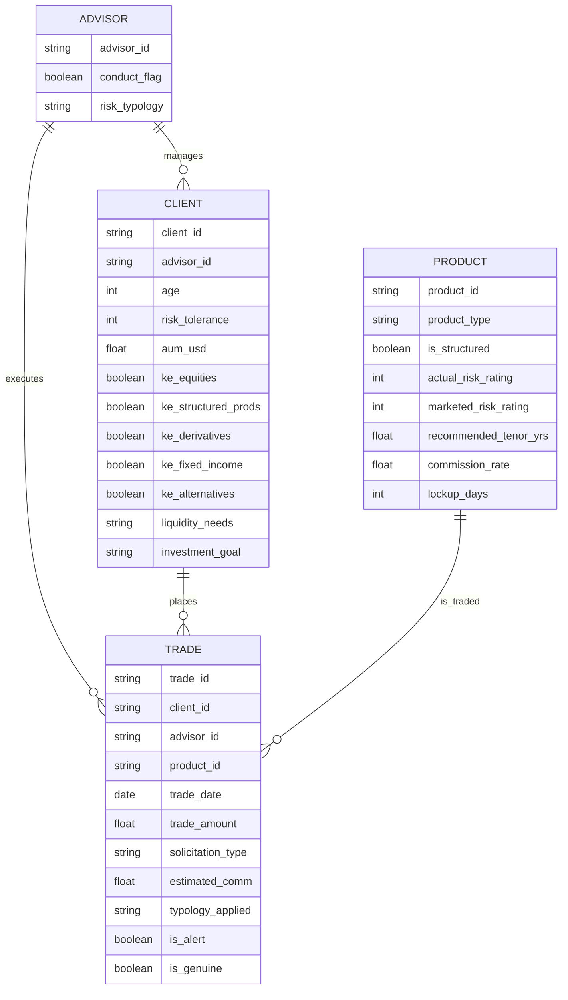

# Synthetic Trade Data & Suitability Alert Generator

## Project Overview

This project generates a realistic synthetic dataset of private-banking trades and suitability alerts, focused on **Mis-selling and Conduct Risk**. It simulates:

- **Advisors** (including a small set of \"bad apples\" with specific risk typologies).
- **Clients** with different risk profiles, knowledge & experience, liquidity needs, investment goals, and age-based risk tolerance.
- **Products** with varying risk levels, commission structures, and liquidity characteristics.
- **Trades** that may or may not breach mechanical suitability rules.

The goal is to produce an ML-ready dataset with:

- **`is_alert`**: whether the trade breaches any hard suitability rule.
- **Per-rule flags** (e.g. K&E mismatch, concentration, risk, liquidity).
- **`is_genuine`**: whether the alert corresponds to a genuine conduct issue driven by bad-apple behaviour.

This project is being developed collaboratively using **Claude Code** to help implement, and document the data-generation pipeline.

## Data Model & Relationships

The synthetic dataset is built around four core entities: advisors, clients, products, and trades. The diagram below shows how they relate to each other.



## Environment Setup

1. **Create and activate a virtual environment** (recommended).
2. Install dependencies:

```bash
pip install -r requirements.txt
```

## Running the MVP with marimo

This project uses a **marimo notebook** to orchestrate the data-generation pipeline.

1. Launch marimo in this project directory (for example):

```bash
marimo edit notebooks/generate_synthetic_trades.py
```

2. In the marimo UI:

- Run the **config cell** to load and optionally tweak parameters from `config/config.json`.
- Run the **generation** and **rules/labeling** cells to build the dataset.
- Run the **export** cell to write:
  - `data/trades.csv`
  - `data/trades.parquet`

3. Use the **summary/EDA** cells to inspect:

- Dataset size.
- Overall alert rate.
- Genuine vs justifiable mismatch proportions.

## Configuration

Core parameters live in `config/config.json`. Key sections:

| Section | What it controls |
|---------|-----------------|
| `sizes` | Number of advisors, clients, and trades |
| `conduct` | Bad-apple rate, typology mix, churning window |
| `clients.age` | Age range (`min` / `max`) |
| `clients.age_epsilon` | Exception rates for age-based rules (see below) |
| `client_generation.distributions` | Base probability distributions for risk tolerance, liquidity needs, and investment goal |
| `client_generation.ke_probability` | K&E flag probabilities (one flat dictionary, applied uniformly across all clients) |
| `rules` | Asset concentration threshold; liquidity mismatch lockup thresholds |
| `labeling` | Label-noise rate |
| `output` | Output directory, filename, CSV/Parquet toggles |

You can safely experiment by changing values in `config/config.json` and re-running the marimo notebook to generate new datasets.

### Client age distribution

Ages are drawn from a **Student's t-distribution** (`df=4`, mean=50, std=12) truncated to `[age_min, age_max]` via rejection sampling. This produces a realistic private-banking book — most clients in their 40s–60s, with a visible fat tail of younger and older clients and no artificial spikes at the boundaries.

### Age-based risk profile adjustments

Older clients are nudged toward more conservative profiles. Two rules apply, both with configurable epsilon exceptions:

**Risk tolerance** — a graduated hard cap by age bracket is applied to the base sampled value:

| Age | Cap |
|-----|-----|
| > 80 | 1 |
| > 75 | 2 |
| > 70 | 3 |
| > 65 | 4 |
| > 55 | 4 |
| ≤ 55 | 5 (uncapped) |

**Investment goal** — probability mass shifts linearly toward `capital preservation` / `income` and away from `growth` / `speculation` for clients above 40, reaching full shift at 80+.

For both rules, `clients.age_epsilon` controls the fraction of clients who are exceptions and ignore the age adjustment entirely (default 5% each). Set to `0` for strict age-driven profiles; increase for more diversity.

### K&E flags

Knowledge & Experience flags are generated from a single flat probability dictionary (`client_generation.ke_probability`), applied uniformly across all clients regardless of risk tolerance. Tune each product-type probability to reflect the realistic K&E distribution you want in your client book.

### Flow Chart for trade generation

flowchart TD
    PICK["Pick random client → resolve advisor"]

    PICK --> ISBAD{Proper Suitability Assessemt?}

    ISBAD -- No --> CLEAN_PICK["_pick_product_for_client_suitable\n① K&E filter\n② Risk filter \n③ Liquidity filter\n(15% justifyable breach chance)\n→ sample from filtered candidates"]
    CLEAN_PICK --> CLEAN_ROW["typology_applied = Clean\nmarketed_risk = actual_risk"]

    ISBAD -- Yes --> TYPCHECK{typology?}

    TYPCHECK -- "Churning\n(remaining ≥ min_cluster_size)" --> CHURN["_generate_churning_cluster\n① cluster_size = rand(3–5)\n② base_day = rand offset\n③ offsets sorted within 60-day window\n④ for each offset: pick from churning_candidates,\n   trade_amount = AUM × rand(5–20%),\n   solicitation = Solicited,\n   typology_applied = Churning"]
    CHURN --> EXTEND["extend trade_rows with cluster"]

    TYPCHECK -- "Unsuitable Recs" --> UR["_pick_product_for_typology\n→ risk ≥ 5 + Structured/Deriv/Alt"]
    UR --> UR_CHECK{"actual_risk ≤\nclient risk_tolerance?"}
    UR_CHECK -- Yes --> DOWNGRADE_UR["typology_applied = Clean"]
    UR_CHECK -- No --> KEEP_UR["typology_applied = Unsuitable Recs"]

    TYPCHECK -- "Misrepresentation" --> MR["_pick_product_for_typology\n→ risk ≥ 4"]
    MR --> MR_CHECK{"actual_risk ≤\nclient risk_tolerance?"}
    MR_CHECK -- Yes --> DOWNGRADE_MR["typology_applied = Clean\nmarketed_risk = actual_risk"]
    MR_CHECK -- No --> KEEP_MR["typology_applied = Misrepresentation\nmarketed_risk = actual_risk − rand(1–2)"]

    TYPCHECK -- "Liquidity Mismatch" --> LM["_pick_product_for_typology\n→ lockup ≥ 365 days\ntypology_applied = Liquidity Mismatch"]
    LM --> LM_CHECK{"product lockup period ≤\nclient lockup period?"}
    LM_CHECK -- Yes --> DOWNGRADE_LM["typology_applied = Clean"]
    LM_CHECK -- No --> KEEP_LM["typology_applied = Liquidity Mismatch"]

    CLEAN_ROW & EXTEND["extend trade_rows with cluster"] & DOWNGRADE_UR & KEEP_UR & DOWNGRADE_MR & KEEP_MR & DOWNGRADE_LM & KEEP_LM --> TRADE["Build trade record\ntrade_id, client_id, advisor_id, product_id\ntrade_date_offset = rand(0–365)\ntrade_amount = AUM × rand(1–25%)\nestimated_comm = amount × commission_rate"]